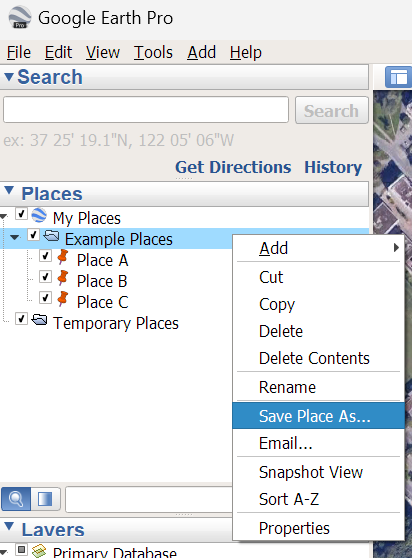
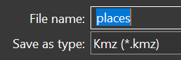
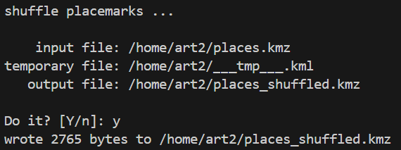
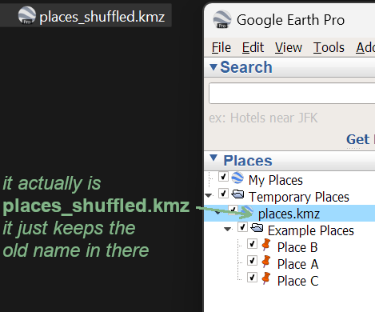

# kmzshuffle

Shuffle randomize the order of placemark's in a folder from [Google Earth](https://earth.google.com) kmz files.

The original file won't be touched. E.g. if your input file is foo.kmz, the output will be named foo_shuffled.kmz.

**Why**: In Google Earth you can only sort a folder with placemarks by A-Z but not randomize the order. This is my quick solution. Didn't test it much - it works with the files I have and it should also with yours.

You can test with the example files in the [doc directory](./doc).

**Also**: Python's built-in xml module is not my friend, so there you have the answer if the method to accomplish the task irritates you 👽


## Dependencies

- [Python](https://python.org) `>= 3.11.2`


## Usage

```text
kmzshuffle.py [-h] [-i FILEPATH] [-y]

options:
  -h, --help   show this help message and exit
  -i FILEPATH  path to the kmz file to read, default: <current_working_directory>/places.kmz
  -y           do not ask for confirmation before starting, default: ask for confirmation
```

```bash
# get help
kmzshuffle.py -h
kmzshuffle.py --help

# run with defaults
kmzshuffle.py

# change input file path
kmzshuffle.py -i /path/to/input.kmz

# skip confirmation with
kmzshuffle.py -y

# combine options
kmzshuffle.py -y -i /path/to/input.kmz
```


## Create Placemarks Folder in Google Earth

Create kmz file from a folder with placemarks. Right-click on folder and select *Save Place as...*:


Give it a name and save as kmz:  


Run kmzshuffle:  


Test shuffled places. Open places_shuffled.kmz in Google Earth again:  



## License

[The Unlicense](./LICENSE.md)
